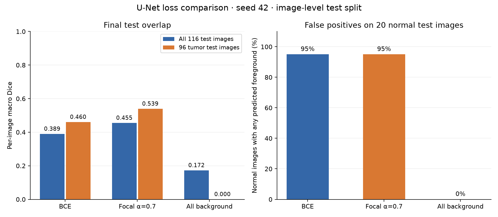

# Findings

Run date: 2026-10-04. Environment: Python 3.12.14, TensorFlow 2.20.0, macOS arm64 CPU.

## Setup

The BUSI version-1 mirror contains 780 images. Excluding two conflicting duplicate records leaves 778 images: 546 train, 116 validation, and 116 test. All 18 secondary annotation files are included in mask unions.

Both runs use the same 1,946,705-parameter U-Net, seed 42, batch size 16, and Adam at 1e-4. Each completed 30 epochs and 1,050 updates. BCE and class-balanced focal loss (alpha 0.7, gamma 2) are the two training objectives. Validation Dice selected epoch 28 for BCE and epoch 29 for focal loss. The threshold is fixed at > 0.5.

## Test results

| Model | Dice | IoU | Tumor Dice | Tumor IoU | Pixel accuracy | Normal FP image rate |
|---|---:|---:|---:|---:|---:|---:|
| BCE | 0.3895 | 0.3107 | 0.4602 | 0.3650 | 0.9528 | 95% |
| Focal α=0.7 | 0.4547 | 0.3516 | 0.5391 | 0.4144 | 0.9416 | 95% |
| All background | 0.1724 | 0.1724 | 0.0000 | 0.0000 | 0.9325 | 0% |

Overall scores average 116 images; tumor scores average the 96 benign/malignant images. Empty ground truth and empty prediction score 1. The all-background reference therefore has nonzero overall overlap despite zero tumor localization.

## Observations

Focal loss increased observed test Dice by 0.0653 absolute. The all-background reference achieved 93.25% pixel accuracy with zero tumor Dice, demonstrating why pixel accuracy alone is insufficient.

Both trained models predicted foreground on 19 of 20 normal images. Mean normal foreground area was 0.54% for BCE and 3.05% for focal loss. Focal loss improved tumor overlap but produced more foreground area on normal images.

## Category scores

| Category | Images | BCE Dice | Focal Dice | BCE IoU | Focal IoU |
|---|---:|---:|---:|---:|---:|
| Benign | 65 | 0.4828 | 0.5226 | 0.3949 | 0.3999 |
| Malignant | 31 | 0.4127 | 0.5737 | 0.3023 | 0.4450 |
| Normal | 20 | 0.0500 | 0.0500 | 0.0500 | 0.0500 |

BCE had 15 zero-overlap tumor cases; focal loss had 5. Prediction figures show missed lesions, incorrect localization, disconnected foreground, and border artifacts. They are generated locally under runs/.

## Limits

This is a single-seed comparison on one dataset. Splits are image-level, patient identities are unavailable, near duplicates may remain, and there is no external validation. Higher overlap in this run does not establish statistical superiority or clinical performance. Normal-image false positives remain a substantial failure mode.

Configurations, histories, per-image scores, environments, and checkpoint-verification results are retained alongside this report.
